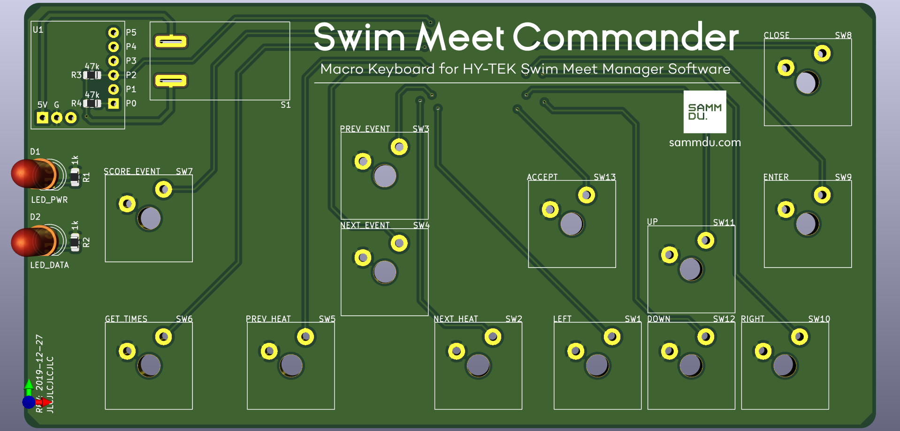
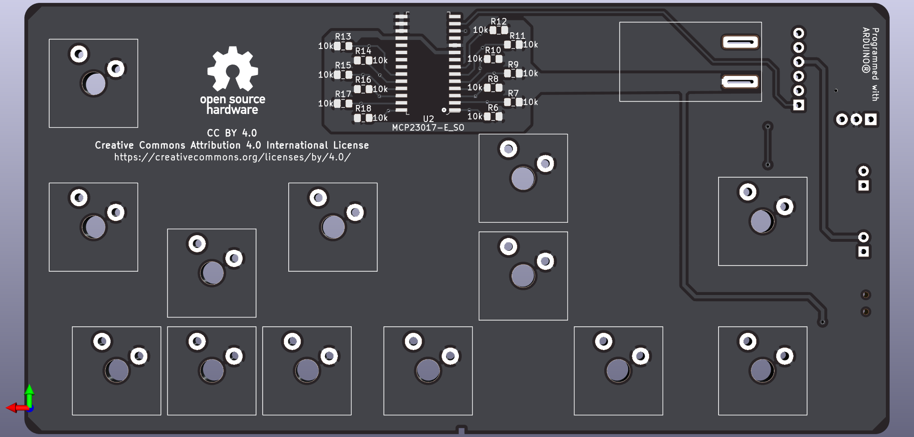

# Swim Meet Commander 
#### Unofficial macro keyboard for the HY-TEK Swim Meet Manager software.

## 3D Renders

## Materials

* Microcontroller: [Digispark Development Board](https://www.amazon.com/DAOKI-Digispark-Kickstarter-ATTINY85-Development/dp/B01MDUHSWO) 
* I/O Expander (to support 13 switches simultaneously): [Microchip MCP23017](https://www.digikey.com/product-detail/en/MCP23017T-E%2fSO/MCP23017T-E%2fSOCT-ND/5358289/) 
* Keyboard Switches: [E-Switch KS1100](https://www.digikey.com/product-detail/en/KS1100OA1AF060/EG5505-ND/7364301/) 
* Key Caps: [TE Connectivity ALCOSWITCH 1571384-4](https://www.digikey.com/product-detail/en/1571384-4/450-1829-ND/1201463/) 
* USB Male-Female Cable: [Qualtek 3021056-01M](https://www.digikey.com/product-detail/en/3021056-01M/Q1104-ND/7795306/) 
* 5mm LEDs 
* 0805 SMD Resistors: `1k` and `47k` values 
