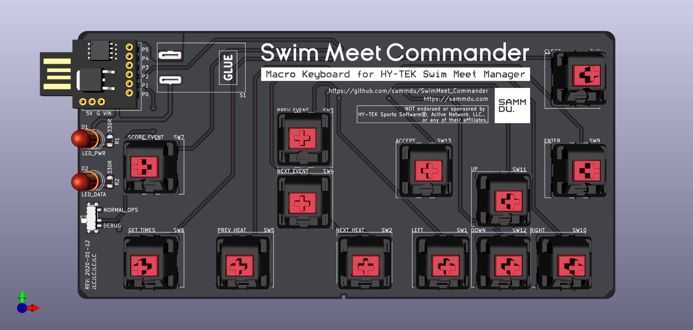
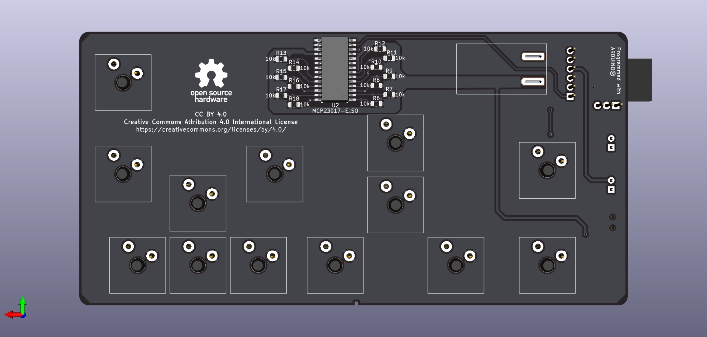

# Swim Meet Commander
#### Unofficial macro keyboard for the [HY-TEK Swim Meet Manager](https://hytek.active.com/swim-meet-software.html) software.
Designed with [KiCad](https://www.kicad-pcb.org/)   
Programmed with [Arduino](https://www.arduino.cc/)   

<a rel="license" href="https://www.oshwa.org/definition/"></a>
&nbsp;&nbsp;
<a rel="license" href="http://creativecommons.org/licenses/by/4.0/"></a>

<br/>

## What Is This
A macro keyboard that controls the swim meet scoring software commonly used in American high-school and college swim meets. It simplifies operation of the software by pulling out 13 most used functionalities as dedicated keys, achieving one-key operation.

The device works by triggering keyboard shortcuts compatible with the swim meet software when a corresponding button is pushed. It is automatically recognized by most operating systems as an HID keyboard with no drivers required.

## 3D Renders



## TODO
* adjust button spacing to account for keycaps
* design 3D printed case

## Materials

* Microcontroller: Digispark Development Board - [Amazon Vendor](https://www.amazon.com/DAOKI-Digispark-Kickstarter-ATTINY85-Development/dp/B01MDUHSWO) | [Official Page (Out of Stock)](http://digistump.com/products/1)
* I/O Expander (to support 13 switches simultaneously): [Microchip MCP23017](https://www.digikey.com/product-detail/en/MCP23017T-E%2fSO/MCP23017T-E%2fSOCT-ND/5358289/)
* Keyboard Switches: [E-Switch KS1100](https://www.digikey.com/product-detail/en/KS1100OA1AF060/EG5505-ND/7364301/)
* Key Caps: [Sparkfun PRT-15305](https://www.sparkfun.com/products/15305), or any Cherry MX compatible models   
* USB Male-Female Cable: [Qualtek 3021056-01M](https://www.digikey.com/product-detail/en/3021056-01M/Q1104-ND/7795306/), or any compatible USB Type-A cable   
* Toggle Switch: [Sparkfun COM-09276](https://www.sparkfun.com/products/9276)
* SMD Slide Switch: [Sparkfun COM-10860](https://www.sparkfun.com/products/10860), or any compatible models
* 5mm LEDs
* 0805 SMD Resistors: `330R`, `4k7` and `10k` values
* Pin Headers

## Copyright & Licensing

This project consists of open source software and hardware, released under [Creative Commons Attribution 4.0 International License](http://creativecommons.org/licenses/by/4.0/), unless otherwise specified.   
This project is NOT endorsed or sponsored by HY-TEK Sports Software®, Active Network, LLC., or any of their affiliates.

**NOTE:**
```
THE SCHEMATICS, DESIGN, SOURCE FILES, SOFTWARE, AND DATASHEETS ARE PROVIDED "AS IS",
WITHOUT WARRANTY OF ANY KIND, EXPRESS OR IMPLIED, INCLUDING BUT NOT LIMITED TO
THE WARRANTIES OF MERCHANTABILITY, FITNESS FOR A PARTICULAR PURPOSE AND
NONINFRINGEMENT. IN NO EVENT SHALL THE AUTHORS OR COPYRIGHT HOLDERS BE LIABLE FOR
ANY CLAIM, DAMAGES OR OTHER LIABILITY, WHETHER IN AN ACTION OF CONTRACT, TORT
OR OTHERWISE, ARISING FROM, OUT OF OR IN CONNECTION WITH THE SCHEMATICS, DESIGN,
SOURCE FILES, SOFTWARE, AND DATASHEETS OR THE USE OR OTHER DEALINGS IN THE
SCHEMATICS, DESIGN, SOURCE FILES, SOFTWARE, AND DATASHEETS.
 ```
